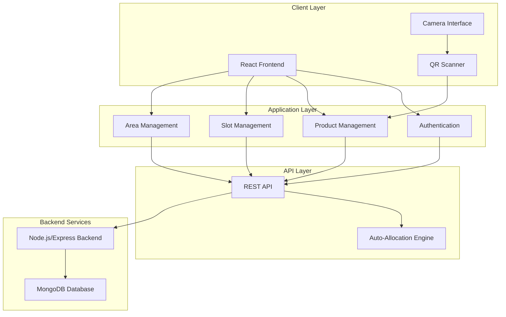
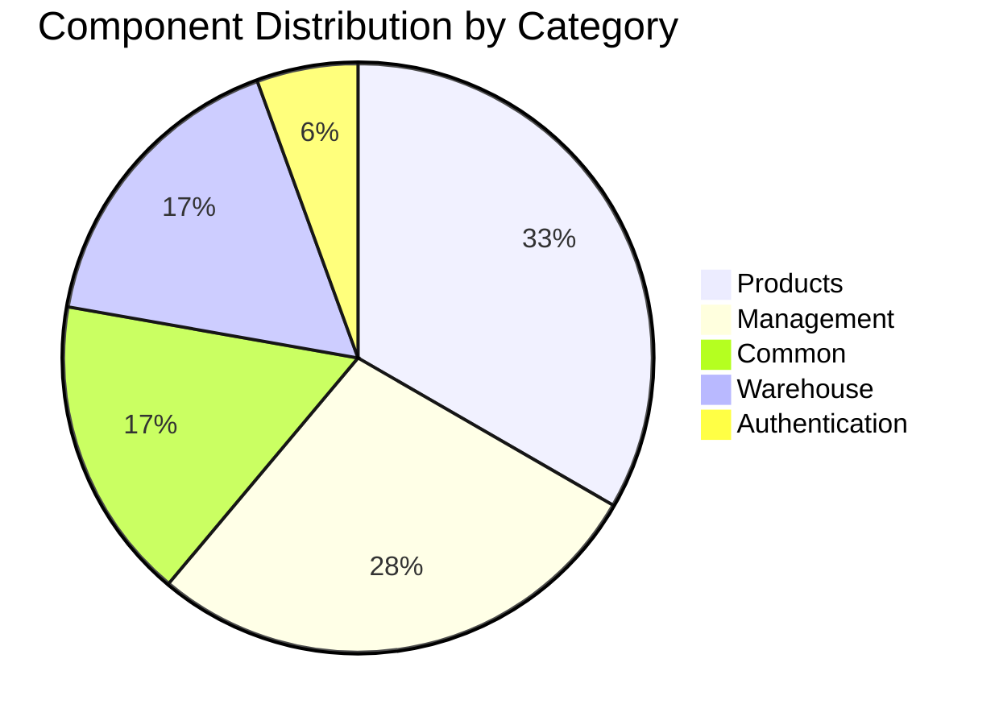

# Warehouse Management System - Project Report

## Executive Summary

The **Warehouse Management System (WMS)** is a modern, full-stack web application designed to streamline warehouse operations through QR code-based inventory management. The system provides real-time tracking of products, automated slot allocation, and comprehensive warehouse visualization capabilities.

**Project Type**: Full-Stack Web Application  
**Development Period**: 2026  
**Current Version**: 0.1.0  
**Status**: Production-Ready  
**GitHub Repository**: [Codinggenie2004/WMS](https://github.com/Codinggenie2004/WMS)

---

## Table of Contents

1. [Project Overview](#project-overview)
2. [Technology Stack](#technology-stack)
3. [System Architecture](#system-architecture)
4. [Core Features](#core-features)
5. [Component Structure](#component-structure)
6. [API Integration](#api-integration)
7. [User Roles & Permissions](#user-roles--permissions)
8. [Development Setup](#development-setup)
9. [Deployment Configuration](#deployment-configuration)
10. [Future Enhancements](#future-enhancements)

---

## Project Overview

### Purpose

The Warehouse Management System addresses the critical need for efficient inventory tracking and management in warehouse environments. By leveraging QR code technology and automated slot allocation, the system minimizes human error and optimizes storage space utilization.

### Key Objectives

- **Automated Inventory Management**: Streamline product storage and retrieval processes
- **Real-time Tracking**: Provide instant visibility into warehouse operations
- **QR Code Integration**: Enable quick product identification and location tracking
- **Role-based Access Control**: Ensure secure operations with admin and user roles
- **Mobile-First Design**: Support warehouse operations on mobile devices

### Target Users

- **Warehouse Administrators**: Full system access for management and configuration
- **Warehouse Staff**: Product scanning, adding, and viewing capabilities
- **Inventory Managers**: Real-time visibility into stock levels and locations

---

## Technology Stack

### Frontend

| Technology | Version | Purpose |
|------------|---------|---------|
| **React** | 19.2.3 | Core UI framework |
| **Tailwind CSS** | 3.4.19 | Utility-first styling |
| **Lucide React** | 0.562.0 | Icon library |
| **html5-qrcode** | 2.3.8 | QR code scanning functionality |
| **React Scripts** | 5.0.1 | Build tooling (Create React App) |

### Development Tools

| Tool | Version | Purpose |
|------|---------|---------|
| **PostCSS** | 8.5.6 | CSS processing |
| **Autoprefixer** | 10.4.23 | CSS vendor prefixing |
| **Testing Library** | 16.3.1 | Component testing |
| **Jest** | (via react-scripts) | Unit testing framework |

### Backend Integration

- **Backend Framework**: Node.js with Express.js
- **Database**: MongoDB (local instance)
- **Communication Protocol**: RESTful HTTP/HTTPS
- **API Port**: 5000
- **Frontend Port**: 3000 (development), configurable for production

### Browser Support

- **Production**: >0.2% market share, not dead, not Opera Mini
- **Development**: Latest Chrome, Firefox, and Safari versions

---

## System Architecture

### High-Level Architecture



### Component Architecture

The application follows a modular component-based architecture:

```
src/
├── components/
│   ├── auth/          # Authentication components
│   ├── common/        # Reusable UI components
│   ├── management/    # Admin management features
│   ├── products/      # Product-related components
│   └── warehouse/     # Warehouse visualization
├── hooks/             # Custom React hooks
├── utils/             # Utility functions and API
└── WarehouseQRSystem.jsx  # Main application component
```

### Data Flow

1. **User Authentication**: Login → API validation → Session management
2. **Product Addition**: Form input → Auto-allocation → Database storage → QR generation
3. **QR Scanning**: Camera → QR decode → Product lookup → Display details
4. **Warehouse Management**: Admin actions → API calls → Real-time updates

---

## Core Features

### 1. Authentication System

- **Secure Login**: Username/password authentication
- **Role-based Access**: Admin and user roles with different permissions
- **Session Management**: Persistent login state during session
- **Error Handling**: User-friendly error messages for failed login attempts

**Implementation**: [`useAuth.js`](file:///c:/Users/Saket/Desktop/WMS2/warehouse-system/src/hooks/useAuth.js)

### 2. Product Management

#### Add Products
- **Auto-allocation Mode**: Automatically assigns products to optimal slots
- **Custom Allocation**: Manual slot selection for specific requirements
- **Bulk Operations**: Support for adding multiple products
- **Image Capture**: Camera integration for product photos

#### Product Features
- Product name, description, and quantity tracking
- Automatic slot assignment based on availability
- QR code generation for each product
- Product search and filtering capabilities

**Key Components**:
- [`ProductForm.jsx`](file:///c:/Users/Saket/Desktop/WMS2/warehouse-system/src/components/products/ProductForm.jsx) (13.4 KB)
- [`ProductList.jsx`](file:///c:/Users/Saket/Desktop/WMS2/warehouse-system/src/components/products/ProductList.jsx) (4.7 KB)
- [`ProductCard.jsx`](file:///c:/Users/Saket/Desktop/WMS2/warehouse-system/src/components/products/ProductCard.jsx) (3.7 KB)

### 3. QR Code Scanning

- **Real-time Scanning**: Live camera feed with QR detection
- **Product Lookup**: Instant product information retrieval
- **Mobile Optimized**: Works seamlessly on mobile devices
- **Error Handling**: Clear feedback for invalid or missing products

**Key Components**:
- [`QRScanner.jsx`](file:///c:/Users/Saket/Desktop/WMS2/warehouse-system/src/components/products/QRScanner.jsx) (9.7 KB)
- [`ScannerTab.jsx`](file:///c:/Users/Saket/Desktop/WMS2/warehouse-system/src/components/products/ScannerTab.jsx) (8.1 KB)
- [`CameraCapture.jsx`](file:///c:/Users/Saket/Desktop/WMS2/warehouse-system/src/components/products/CameraCapture.jsx) (4.2 KB)

### 4. Warehouse Visualization

- **Interactive Grid View**: Visual representation of warehouse layout
- **Slot Status Indicators**: Color-coded occupied/available slots
- **Area Organization**: Logical grouping of storage areas
- **Real-time Updates**: Instant reflection of inventory changes

**Key Component**: [`WarehouseView.jsx`](file:///c:/Users/Saket/Desktop/WMS2/warehouse-system/src/components/warehouse/WarehouseView.jsx)

### 5. Administrative Management

#### Slot Management
- Create individual slots with custom IDs
- Bulk slot creation for efficiency
- Delete empty slots
- View slot occupancy status

#### Area Management
- Create logical warehouse areas
- Organize slots by area
- Delete areas (with validation)
- Area-based filtering

**Key Components**:
- [`ManageSlotsAreas.jsx`](file:///c:/Users/Saket/Desktop/WMS2/warehouse-system/src/components/management/ManageSlotsAreas.jsx)
- [`CreateSlots.jsx`](file:///c:/Users/Saket/Desktop/WMS2/warehouse-system/src/components/management/CreateSlots.jsx) (5.4 KB)
- [`CreateArea.jsx`](file:///c:/Users/Saket/Desktop/WMS2/warehouse-system/src/components/management/CreateArea.jsx) (3.6 KB)
- [`ManageAreas.jsx`](file:///c:/Users/Saket/Desktop/WMS2/warehouse-system/src/components/management/ManageAreas.jsx) (3.5 KB)
- [`ManageExistingSlots.jsx`](file:///c:/Users/Saket/Desktop/WMS2/warehouse-system/src/components/management/ManageExistingSlots.jsx) (4.0 KB)

### 6. Dashboard & Analytics

**Statistics Display** (Admin Only):
- Total products count
- Total slots count
- Occupied slots count
- Available slots count

**Visual Indicators**:
- Color-coded stat cards
- Icon-based representation
- Real-time data updates

---

## Component Structure

### Core Components

#### Main Application
**[`WarehouseQRSystem.jsx`](file:///c:/Users/Saket/Desktop/WMS2/warehouse-system/src/WarehouseQRSystem.jsx)** (157 lines)
- Central application component
- Tab-based navigation system
- Role-based UI rendering
- State management coordination

#### Authentication
**[`LoginForm.jsx`](file:///c:/Users/Saket/Desktop/WMS2/warehouse-system/src/components/auth/LoginForm.jsx)**
- User authentication interface
- Error handling and validation
- Loading states

#### Common Components
**[`Header.jsx`](file:///c:/Users/Saket/Desktop/WMS2/warehouse-system/src/components/common/Header.jsx)**
- Application header with branding
- User information display
- Logout and refresh actions

**[`StatsCard.jsx`](file:///c:/Users/Saket/Desktop/WMS2/warehouse-system/src/components/common/StatsCard.jsx)**
- Reusable statistics display
- Icon and color customization

**[`TabButton.jsx`](file:///c:/Users/Saket/Desktop/WMS2/warehouse-system/src/components/common/TabButton.jsx)**
- Navigation tab component
- Active state styling

### Custom Hooks

#### [`useAuth.js`](file:///c:/Users/Saket/Desktop/WMS2/warehouse-system/src/hooks/useAuth.js) (38 lines)
Manages authentication state and operations:
- `login(username, password)` - Authenticate user
- `logout()` - Clear user session
- State: `currentUser`, `loginError`, `loading`

#### [`useWarehouse.js`](file:///c:/Users/Saket/Desktop/WMS2/warehouse-system/src/hooks/useWarehouse.js) (58 lines)
Manages warehouse data and operations:
- `fetchProducts()` - Retrieve all products
- `fetchSlots()` - Retrieve all slots
- `fetchAreas()` - Retrieve all areas
- `refreshAll()` - Refresh all data
- State: `products`, `slots`, `areas`, `loading`

---

## API Integration

### API Configuration

**Base URL**: Dynamic based on hostname
```javascript
const API_URL = `http://${hostname}:5000/api`
```

### API Endpoints

#### Authentication
| Endpoint | Method | Purpose |
|----------|--------|---------|
| `/api/login` | POST | User authentication |

#### Products
| Endpoint | Method | Purpose |
|----------|--------|---------|
| `/api/products` | GET | Retrieve all products |
| `/api/products/search` | POST | Search for products |
| `/api/auto-store` | POST | Add product with auto-allocation |
| `/api/allocate-custom` | POST | Add product with custom slot |
| `/api/products/:id` | DELETE | Delete product |

#### Slots
| Endpoint | Method | Purpose |
|----------|--------|---------|
| `/api/slots` | GET | Retrieve all slots |
| `/api/slot` | POST | Create single slot |
| `/api/slots/bulk` | POST | Create multiple slots |
| `/api/slots/:id` | DELETE | Delete slot |

#### Areas
| Endpoint | Method | Purpose |
|----------|--------|---------|
| `/api/areas` | GET | Retrieve all areas |
| `/api/area` | POST | Create area |
| `/api/areas/:id` | DELETE | Delete area |

### Error Handling

The API utility implements comprehensive error handling:
- Network connectivity errors
- HTTP status code validation
- User-friendly error messages
- Console logging for debugging

**Implementation**: [`api.js`](file:///c:/Users/Saket/Desktop/WMS2/warehouse-system/src/utils/api.js) (111 lines)

---

## User Roles & Permissions

### Admin Role

**Full Access**:
- ✅ View dashboard statistics
- ✅ Add/delete products
- ✅ Scan QR codes
- ✅ View warehouse layout
- ✅ Manage slots (create/delete)
- ✅ Manage areas (create/delete)
- ✅ View all products
- ✅ Access all tabs

### User Role

**Limited Access**:
- ✅ Add products
- ✅ Scan QR codes
- ✅ View products
- ❌ View dashboard statistics
- ❌ View warehouse layout
- ❌ Manage slots/areas

### Permission Implementation

Role-based rendering is implemented throughout the application:

```javascript
{currentUser.role === 'admin' && (
  <AdminOnlyComponent />
)}
```

---

## Development Setup

### Prerequisites

- **Node.js**: v14.0.0 or higher
- **npm**: v6.0.0 or higher
- **Backend Server**: Python-based API running on port 5000

### Installation Steps

1. **Clone the repository**:
   ```bash
   git clone https://github.com/Codinggenie2004/WMS.git
   cd WMS/warehouse-system
   ```

2. **Install dependencies**:
   ```bash
   npm install
   ```

3. **Configure environment**:
   Create/verify `.env` file:
   ```env
   HOST=0.0.0.0
   GENERATE_SOURCEMAP=false
   HTTPS=true
   ```

4. **Start development server**:
   ```bash
   npm start
   ```

5. **Access application**:
   - Local: `https://localhost:3000`
   - Network: `https://<your-ip>:3000`

### Available Scripts

| Command | Purpose |
|---------|---------|
| `npm start` | Start development server |
| `npm test` | Run test suite |
| `npm run build` | Create production build |
| `npm run eject` | Eject from Create React App |

---

## Deployment Configuration

### Environment Configuration

The application uses environment variables for deployment configuration:

```env
HOST=0.0.0.0          # Allow network access
GENERATE_SOURCEMAP=false  # Disable source maps in production
HTTPS=true            # Enable HTTPS (required for camera access)
```

### HTTPS Requirement

> [!IMPORTANT]
> HTTPS is **required** for camera functionality (QR scanning). Modern browsers block camera access over HTTP for security reasons.

### Network Access

The application is configured to accept connections from any network interface (`0.0.0.0`), enabling:
- Local development access
- Mobile device testing on the same network
- Remote warehouse terminal access

### Production Build

To create a production-optimized build:

```bash
npm run build
```

This generates a `build/` folder with:
- Minified JavaScript and CSS
- Optimized assets
- Production-ready static files

---

## Future Enhancements

### Planned Features

1. **Advanced Analytics**
   - Inventory turnover reports
   - Storage efficiency metrics
   - Historical data visualization

2. **Barcode Support**
   - Support for traditional barcodes
   - Multi-format scanning

3. **Export Functionality**
   - CSV/Excel export of inventory data
   - PDF report generation

4. **Notifications**
   - Low stock alerts
   - Slot capacity warnings
   - Real-time updates via WebSocket

5. **Mobile App**
   - Native iOS/Android applications
   - Offline capability
   - Push notifications

6. **Multi-warehouse Support**
   - Manage multiple warehouse locations
   - Inter-warehouse transfers
   - Consolidated reporting

7. **Advanced Search**
   - Full-text search
   - Filter by multiple criteria
   - Saved search queries

8. **Audit Trail**
   - Complete action history
   - User activity logs
   - Change tracking

---

## Project Statistics

### Codebase Metrics

| Metric | Value |
|--------|-------|
| **Total Components** | 18+ |
| **Custom Hooks** | 2 |
| **API Endpoints** | 11 |
| **Dependencies** | 11 production, 5 dev |
| **Main Component Size** | 157 lines |
| **Largest Component** | ProductForm.jsx (13.4 KB) |

### Component Distribution



---

## Technical Highlights

### 1. Modern React Patterns
- Functional components with hooks
- Custom hook abstractions
- Efficient state management
- Component composition

### 2. Responsive Design
- Mobile-first approach
- Tailwind CSS utility classes
- Adaptive layouts
- Touch-friendly interfaces

### 3. Performance Optimization
- Lazy loading considerations
- Efficient re-rendering
- Optimized bundle size
- Production build optimization

### 4. Code Quality
- Consistent code style
- Component modularity
- Separation of concerns
- Reusable utilities

### 5. User Experience
- Loading states
- Error handling
- Visual feedback
- Intuitive navigation

---

## Conclusion

The Warehouse Management System represents a comprehensive solution for modern warehouse operations. Built with cutting-edge web technologies and following best practices, the system delivers a robust, scalable, and user-friendly platform for inventory management.

### Key Achievements

✅ **Full-featured inventory management system**  
✅ **QR code integration for efficient tracking**  
✅ **Role-based access control**  
✅ **Mobile-responsive design**  
✅ **Real-time warehouse visualization**  
✅ **Automated slot allocation**  
✅ **Production-ready deployment**

### Project Success Factors

- **Modern Technology Stack**: React 19, Tailwind CSS, latest tooling
- **Modular Architecture**: Clean separation of concerns
- **User-Centric Design**: Intuitive interface for warehouse staff
- **Scalability**: Architecture supports future enhancements
- **Security**: HTTPS, role-based permissions, secure authentication

---

## Contact & Repository

**GitHub Repository**: [https://github.com/Codinggenie2004/WMS](https://github.com/Codinggenie2004/WMS)  
**Project Location**: `c:\Users\Saket\Desktop\WMS2\warehouse-system`  
**Report Generated**: February 15, 2026

---

*This report provides a comprehensive overview of the Warehouse Management System project, including architecture, features, and technical implementation details.*
